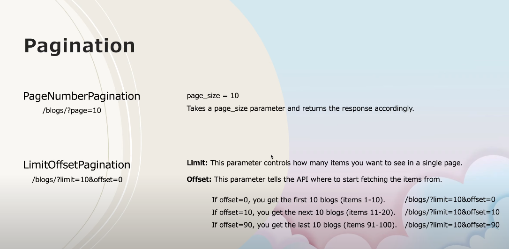
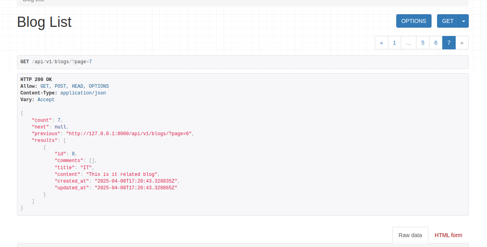

# Blog App API with Pagination

This project is a Django REST Framework (DRF) API for managing blogs and comments. It includes pagination for listing blogs and comments.

## Features
- List, create, retrieve, update, and delete blogs.
- List, create, retrieve, update, and delete comments.
- Pagination for blog and comment lists.

---

## Pagination Setup

### 1. **Global Pagination**
Pagination is configured globally in the `settings.py` file using DRF's `DEFAULT_PAGINATION_CLASS`. Example:

```python
# filepath: /home/manmohan/Documents/Projects/Blog_app_API-DRF/DRF_main/settings.py

REST_FRAMEWORK = {
    'DEFAULT_PAGINATION_CLASS': 'rest_framework.pagination.PageNumberPagination',
    'PAGE_SIZE': 10,  # Number of items per page
}


```



```